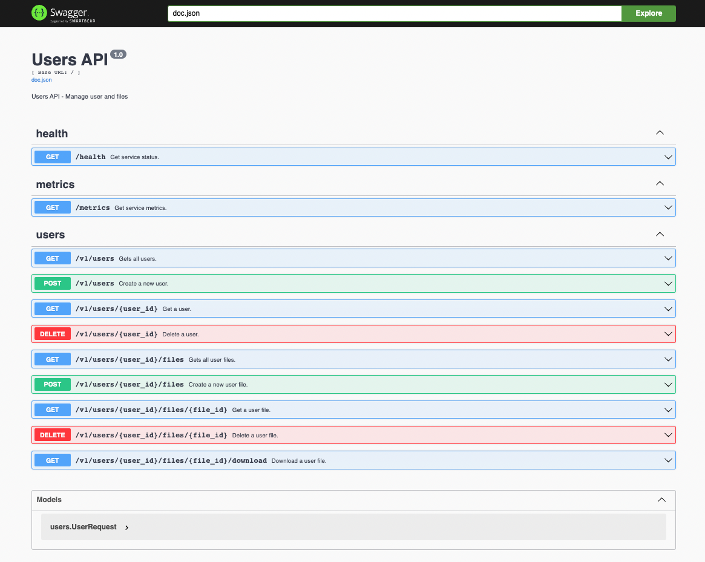
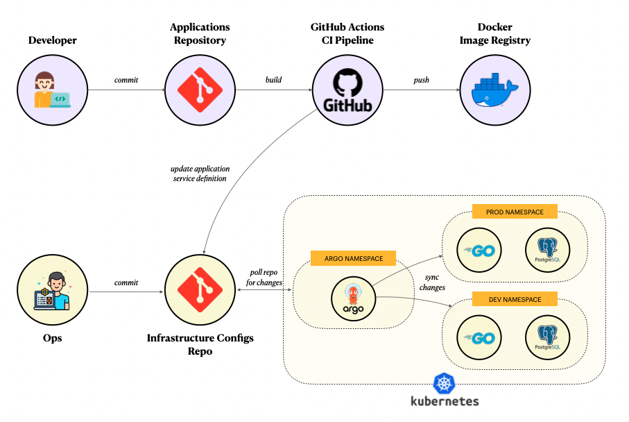

# k8s-user-mgmt

## Table of Contents

- [Overview](#overview)
- [Architecture](#architecture)
- [How to run the application](#how-to-run-the-application)
  - [Prerequisites](#prerequisites)
  - [Steps](#steps)
- [Next steps](#next-steps)

## Overview

The purpose of this repository was to create a microservice to manage users which allows each user to 
submit one or more files (for the purpose of this repo the file will be fetched from the `dummy-pdf-or-png` service) 
and saved in the MySQL database.

In the case of a file being a PDF, the file will be checked to ensure it is a valid PDF file. If not,
the following error is returned:

```json
{
  "status_code": 400,
  "error": "file possibly corrupted. could not open file: missing catalog"
}
```

The microservice implemented exposes the following endpoints:



## Architecture

This project uses the following tools

For the golang microservice:

1. Chi as the http router
2. Gorm as the ORM
3. goose as the database migration tool
4. MySQL as the database
5. Docker as the containerization tool
6. Swagger as the API documentation tool
7. Zap for structured logging
8. UberFx for dependency injection
9. Prometheus to expose metrics

For the infrastructure to support the application:

1. Docker-compose as the local environment for development and testing
2. Terraform as the IaC tool
3. Kind as the local kubernetes cluster
4. Helm as the package manager for kubernetes

For the CI/CD pipeline:

1. GitHub actions as the CI/CD tool to build and publish the docker image to dockerhub
2. ArgoCD as the CD tool to deploy the application to the kubernetes cluster

Please find below a short diagram on how the CI/CD works for this project.



## How to run the application

### Prerequisites

1. Install docker (https://docs.docker.com/get-docker/)
2. Install docker-compose (https://docs.docker.com/compose/install/)
3. Install terraform (https://learn.hashicorp.com/tutorials/terraform/install-cli)
4. Install kind (https://kind.sigs.k8s.io/docs/user/quick-start/#installation)
5. Install kubectl (https://kubernetes.io/docs/tasks/tools/install-kubectl/)
6. Install helm (https://helm.sh/docs/intro/install/)

### Steps

1. Create all underlying infrastructure using terraform

```bash
make infra
```

2. Access ArgoCD to view the deployed applications

```bash
kubectl port-forward svc/argocd-server -n argocd 5555:80
```

The ArgoCD UI can then be accessed at `http://localhost:5555`.

**_Notes:_**

The default username for ArgoCD is `admin`. The password is auto-generated 
and we can get it with the following command:

```bash
kubectl -n argocd get secret argocd-initial-admin-secret -o jsonpath="{.data.password}" | base64 -d
```

3. Whenever a change is made to any of the services, the CI will build a new image and commit the new identified 
to the repo and ArgoCD will deploy the new version of the application to the kubernetes cluster automatically.

4. To destroy the infrastructure you can run the below command

```bash
make infra-destroy
```

## Next steps

1. Add authentication to the microservice
2. Add an ingress to the k8s cluster
3. Add unit and integration tests
4. Add additional custom metrics to prometheus
5. Use a cloud provider to deploy the application
6. Separate repo for the ArgoCD application manifests
7. Deploy Prometheus operator in the k8s cluster